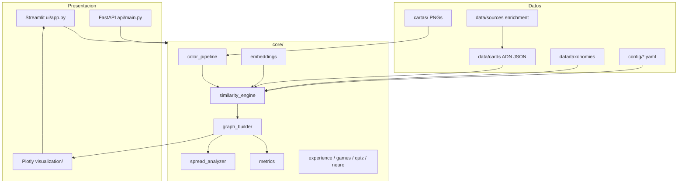
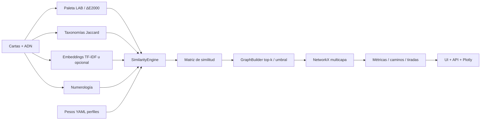
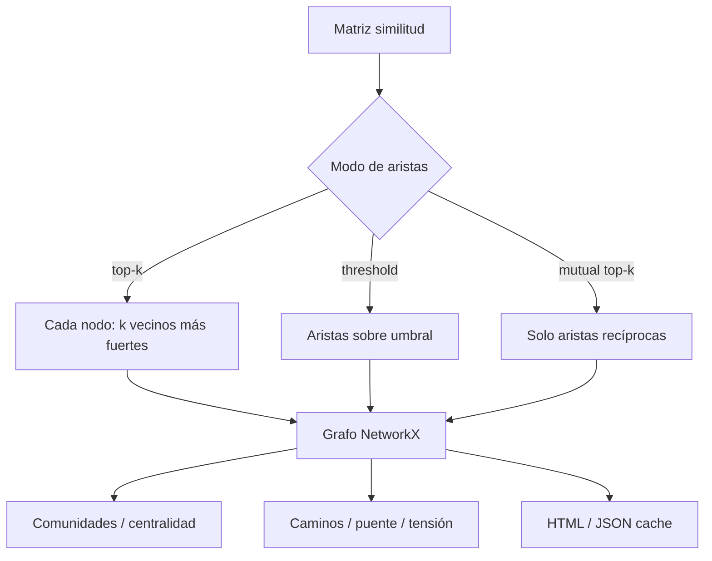

# El Tejido Arcano — ArcanaGraph Lab

Laboratorio local-first para explorar **relaciones posibles** entre cartas de Tarot mediante color, símbolos, semántica y **teoría de grafos**. Pensado para estudio, juego y reflexión — no para predicción del futuro ni consejos médicos, legales o financieros.

> **Aviso ético:** las conexiones dependen de datos anotados y pesos configurables. No son verdades universales ni predicciones verificadas. No sustituye atención profesional.

---

## Qué es

**El Tejido Arcano** (nombre de producto en la UI) / **ArcanaGraph Lab** (nombre técnico del laboratorio) es una plataforma experimental en Python que:

- Anota los **22 Arcanos Mayores** como ADN estructurado (`data/cards/`).
- Compara cartas en **varias dimensiones** (color LAB/ΔE, símbolos, arquetipos, emociones, elementos, narrativa, numerología, semántica).
- Construye un **grafo multicapa** (top-k / umbral / mutual) y lo visualiza en 2D/3D.
- Ofrece experiencias interactivas: juegos, test «Quién eres», mapa neurológico metafórico, historias y tiradas reflexivas.
- Integra voces de estudio inspiradas en **Jodorowsky & Costa** (*La vía del Tarot*) y **Miguel Ángel Díaz Canseco** (*El tarot: del dilema a la metáfora*), en forma de **paráfrasis** de laboratorio — no reproducción del libro completo.

---

## Ventajas de usarlo

| Ventaja | Por qué importa |
|---------|-----------------|
| **Similitud multidimensional** | No reduce “parecido” a un solo criterio: color + taxonomías + texto + numerología con perfiles de pesos. |
| **Grafos explícitos** | Comunidades, caminos, puentes y tensión entre cartas son visibles y auditables. |
| **Local-first** | Corre en tu máquina; embeddings por defecto TF-IDF (sin API). Secrets opcionales en `.env`. |
| **Juegos y exploración** | Memoria, “¿cuál no encaja?”, oráculo de 1 minuto, tirada-cine, puente, constelación. |
| **Quién eres** | Test arcano + carta guía por fecha + mapa de 22 — lenguaje reflexivo, sin diagnóstico psicológico. |
| **Mapa neurológico metafórico** | Analogía educativa carta↔región; **no** es mapa clínico. |
| **Fuentes de estudio** | Capas Jodorowsky / Canseco en el detalle de carta, con ética de paráfrasis. |
| **Sin predicción médica/legal** | Disclaimer en UI/API/docs; lenguaje de hipótesis (“podría sugerir”). |
| **API + UI** | Streamlit para humanos; FastAPI/OpenAPI para integrar o automatizar. |
| **Reproducible** | Semilla, YAML de pesos, tests con `pytest`. |

---

## Requisitos

- **Python 3.11+** (probado con 3.11 y 3.13)
- Windows (flujo principal) o Linux/macOS
- Datos incluidos en el repo:
  - `data/cards/*.json` — ADN de los 22 mayores
  - `cartas/*.png` (y/o `assets/cards/`) — imágenes para color y UI
- Opcional: PDFs de fuentes **propios** solo si quieres re-ejecutar scripts de extracción (no se incluyen)

---

## Instalación portable

### Windows (recomendado)

```powershell
cd Grafos   # o la carpeta del clone
.\setup.ps1
```

El script crea `env\`, instala `requirements.txt`, copia `.env.example` → `.env` si falta, y valida/siembra cartas si hace falta.

### Linux / macOS

```bash
chmod +x setup.sh
./setup.sh
# o: PYTHON=python3.13 ./setup.sh
```

### Manual (cualquier SO)

```bash
python -m venv env

# Windows
.\env\Scripts\Activate.ps1
# Linux/macOS
source env/bin/activate

python -m pip install -r requirements.txt
cp .env.example .env   # o: copy .env.example .env
```

Si `data/cards/` está vacío:

```bash
python scripts/seed_major_arcana.py
python scripts/migrate_legacy_cartas.py   # si tienes PNGs en cartas/
python scripts/validate_card_data.py
```

### Datos necesarios

| Ruta | Qué es |
|------|--------|
| `data/cards/` | ADN JSON de cada arcano mayor (**necesario**) |
| `cartas/*.png` | Imágenes legacy para pipeline cromático (**necesario** para color) |
| `assets/cards/` | Assets de UI (opcional si ya están las de `cartas/`) |
| `config/*.yaml` | Semilla, top-k, perfiles de pesos |
| `data/sources/*/enrichment.json` | Paráfrasis de estudio (incluidas) |
| Extractos `major_*.txt` / PDF full | **No** van al repo; regenerables localmente |

---

## Cómo arrancar

### UI Streamlit (experiencia principal)

```powershell
.\env\Scripts\python.exe -m streamlit run ui/app.py
# o, con venv activado:
python -m streamlit run ui/app.py
```

Abre el navegador en la URL que indique Streamlit (suele ser `http://localhost:8501`).

### API FastAPI

```powershell
.\env\Scripts\python.exe -m uvicorn api.main:app --reload --port 8000
```

Documentación OpenAPI: http://127.0.0.1:8000/docs

### Reconstruir grafo (cache)

```powershell
.\env\Scripts\python.exe scripts\rebuild_graph.py
```

Genera JSON/HTML en `data/cache/graphs/` (carpeta ignorada por git) y un run en `data/processing_runs/`.

### Prototipo legacy

```powershell
.\env\Scripts\python.exe tarot_grafo.py
```

### Tests

```powershell
.\env\Scripts\python.exe -m pytest tests -q
```

---

## Mapa de secciones de la UI

Menú lateral de **El Tejido Arcano**:

| Sección | Para qué |
|---------|----------|
| **Inicio** | Bienvenida, carta del día, orientación |
| **Quién eres** | Test arcano, carta guía por fecha, mapa de 22 |
| **Juegos de cartas** | Memoria, ¿cuál no encaja?, oráculo 1 min, tirada-cine |
| **Mapa neurológico** | Metáfora educativa carta ↔ región cerebral |
| **Contar una historia** | Tres cartas + finales alternativos |
| **Constelación** | Vecindario de una carta con explicación |
| **Juego del puente** | Elegir el puente simbólico entre dos nodos |
| **Mirar el mapa** | Grafo interactivo (capa + perfil + top-k) |
| **Conocer una carta** | Detalle + voces de estudio |
| **Comparar dos cartas** | Similitud desglosada por dimensión |
| **Leer una tirada** | Análisis de 3 cartas (puente, tensión, hipótesis) |
| **Buscar un camino** | Camino oculto / shortest path en el grafo |
| **Buscar por idea** | Búsqueda por keywords / taxonomías |
| **Descubrimientos** | Laboratorio ML (visión / texto / grafo) |

Ajustes opcionales en el sidebar: perfil de comparación, tipo de conexión, conexiones por carta (top-k).

---

## Arquitectura



Capas:

| Capa | Responsabilidad |
|------|-----------------|
| `schemas/` | Contratos Pydantic (ADN, resultados) |
| `core/` | Dominio puro: color, similitud, grafo, juegos, neuro |
| `visualization/` | Plotly (grafo, cerebro 3D) |
| `api/` / `ui/` | Interfaces |
| `data/` | ADN, taxonomías, fuentes, cache, runs |
| `config/` | YAML versionable |

Más detalle: [`docs/ARQUITECTURA.md`](docs/ARQUITECTURA.md).

---

## Flujo de datos y similitud



**Fórmula (concepto):**  
`similarity_total = Σ weight_i × score_i`  
Perfiles: `equilibrado`, `visual`, `psicologico`, `tradicional`, `narrativo` (deben sumar 1.0).

Detalle: [`docs/MOTOR_SIMILITUD.md`](docs/MOTOR_SIMILITUD.md), [`docs/METRICAS_GRAFO.md`](docs/METRICAS_GRAFO.md).

### Grafo: de similitud a red



---

## Estructura de carpetas

```
Grafos/
├── api/                 # FastAPI
├── assets/cards/        # Imágenes UI
├── cartas/              # PNGs legacy (pipeline cromático)
├── config/              # pipeline.yaml, similarity_weights.yaml
├── core/                # Dominio
├── data/
│   ├── cards/           # ADN JSON (22 mayores)
│   ├── taxonomies/      # Vocabularios
│   ├── sources/         # enrichment.json (+ extractos locales ignorados)
│   ├── cache/           # Generado (gitignored)
│   └── processing_runs/ # Historial de rebuilds
├── docs/                # Documentación detallada
├── schemas/             # Pydantic
├── scripts/             # seed, migrate, validate, rebuild, extract*
├── tests/
├── ui/                  # Streamlit
├── visualization/
├── setup.ps1 / setup.sh
├── requirements.txt
├── .env.example
└── tarot_grafo.py       # Entrada legacy
```

---

## Fuentes y ética

- **Paráfrasis de estudio** en `data/sources/*/enrichment.json` y campos `significados[]` de cada carta.
- Extractos crudos de libros (`via_del_tarot_full.txt`, `major_*.txt`, etc.) **no se versionan**; `.gitignore` los excluye.
- Scripts `scripts/extract_*.py` aceptan rutas por **variable de entorno** o argumento CLI (sin rutas personales hardcodeadas).
- Lenguaje recomendado: “podría sugerir”, “hipótesis dentro de este modelo”.
- Ver [`docs/FUENTES_SIGNIFICADO.md`](docs/FUENTES_SIGNIFICADO.md) y [`docs/GUIA_USUARIO.md`](docs/GUIA_USUARIO.md).

---

## Configuración

- `config/pipeline.yaml` — semilla, K-Means, top-k, umbral, proveedor embeddings  
- `config/similarity_weights.yaml` — perfiles de pesos  
- `.env` — rutas y secrets **opcionales** (nunca commits; usa `.env.example`)

---

## Documentación (`docs/`)

| Doc | Contenido |
|-----|-----------|
| [GUIA_USUARIO.md](docs/GUIA_USUARIO.md) | Uso seguro e interpretación |
| [GUIA_DESARROLLO.md](docs/GUIA_DESARROLLO.md) | Desarrollo local |
| [ARQUITECTURA.md](docs/ARQUITECTURA.md) | Capas y decisiones |
| [MODELO_DATOS.md](docs/MODELO_DATOS.md) | ADN de carta |
| [MOTOR_SIMILITUD.md](docs/MOTOR_SIMILITUD.md) | Dimensiones y pesos |
| [METRICAS_GRAFO.md](docs/METRICAS_GRAFO.md) | Métricas de red |
| [ANALIZADOR_TIRADAS.md](docs/ANALIZADOR_TIRADAS.md) | Tiradas de 3 |
| [ML_VISION_TEXTO_GRAFO.md](docs/ML_VISION_TEXTO_GRAFO.md) | Descubrimientos ML |
| [FUENTES_SIGNIFICADO.md](docs/FUENTES_SIGNIFICADO.md) | Fuentes y ética |
| [ROADMAP.md](docs/ROADMAP.md) | Hecho / próximo |
| [AUDITORIA_PROYECTO.md](docs/AUDITORIA_PROYECTO.md) | Auditoría inicial |

---

## Roadmap breve

**Hecho:** ADN 22 mayores, motor multidimensión, grafo top-k, UI/API, juegos, Quién eres, mapa neurológico, enriquecimiento dual, tests.

**Próximo:** arcanos menores, embeddings locales empaquetados, comparador Rider–Marsella con datos reales, SQLite de tiradas, persistencia de settings vía API.

Más: [`docs/ROADMAP.md`](docs/ROADMAP.md).

---

## Disclaimer

Este software es un **laboratorio educativo y creativo**. No realiza diagnósticos médicos ni psicológicos, no ofrece asesoramiento legal o financiero, y **no predice el futuro**. Cualquier lectura simbólica es una hipótesis dentro de un modelo de datos anotados y pesos elegidos por el usuario. Usa el lenguaje con cuidado y respeta los límites éticos descritos en la UI y en `docs/`.

---

## Licencia y privacidad del repositorio

El repositorio se mantiene **privado** hasta que el autor decida publicarlo. No publiques `.env`, PDFs de terceros ni extractos textuales largos de obras con derechos de autor.
